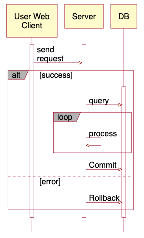

# Umalu
Umalu draws UML sequence diagram by ASCII art.

## How To Use
Add your HTML source to below HTML fragment.
```html
<script src="umalu-sequence.js"></script>
```

## Drawing UML sequence diagram
```
<script type="text/x-umalu-sequence">
   +--------------+  +----------+     +--------+
   |   User Web   |  |  Server  |     |   DB   |
   |    Client    |  +----------+     +--------+
   +--------------+        |              |
           |               |              |
          +-+ send        +-+             |
          | | request     | |             |
          | |------------>| |             |
          | |             | |             |
    +-------------------------------------------+
    |alt/ | |[success]    | |             |     |
    |     | |             | |            +-+    |
    |     | |             | |query       | |    |
    |     | |             | |----------->| |    |
    |     | |             | |            | |    |
    |     | |   +-----------------------------+ |
    |     | |   |loop/    | |            | |  | |
    |     | |   |         | |--,         | |  | |
    |     | |   |         | |  | process | |  | |
    |     | |   |         | |<-'         | |  | |
    |     | |   +-----------------------------+ |
    |     | |             | |            | |    |
    |     | |             | |Commit      | |    |
    |     | |             | |----------->| |    |
    |     | |             | |            | |    |
    |-------------------------------------------|
    |     | |[error]      | |            | |    |
    |     | |             | |Rollback    | |    |
    |     | |             | |----------->| |    |
    +-------------------------------------------+
          | |             | |            | |
          +-+             +-+            +-+
           |               |              |
</script>
```

Result:  


## License
MIT
